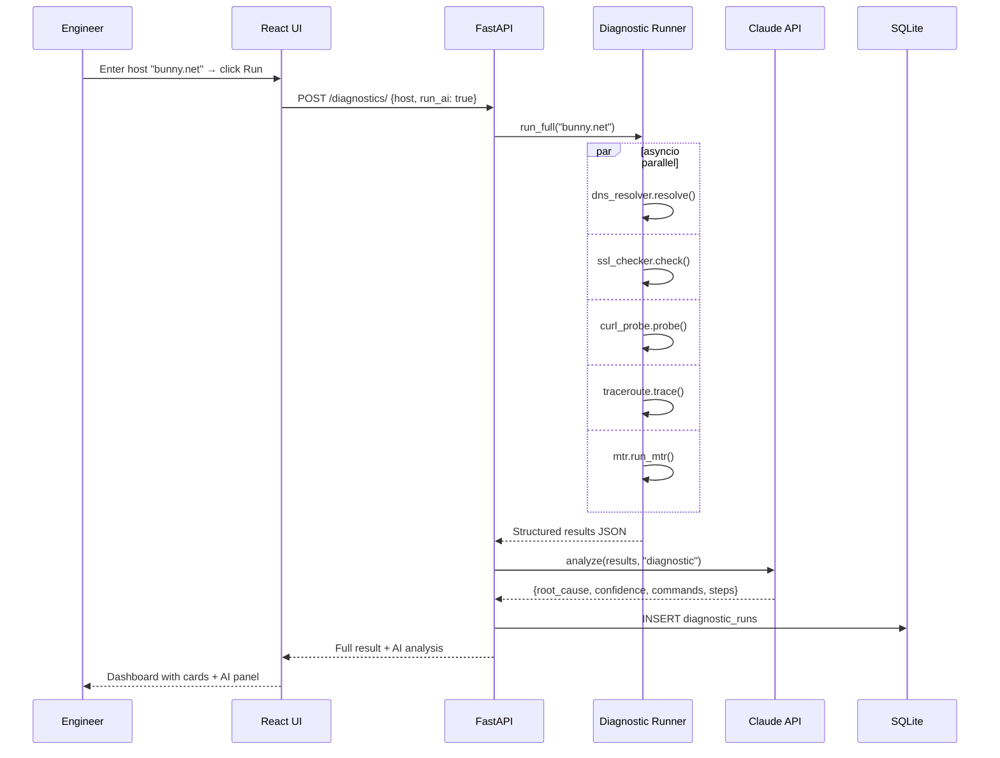

# NetSight 🔭

> **Intelligent Network Diagnostic & Observability Platform**  
> Wireshark + Fiddler + Grafana + AI SRE — in one browser tab.

Built for CDN/edge infrastructure support engineers. Replaces the scattered toolkit of `traceroute`, `curl`, `mtr`, `dig`, Wireshark, tcpdump, and Fiddler with a unified web app that adds AI-powered root cause analysis and resolution recommendations.

---

## Why It Exists

### The Problem

When a CDN edge node misbehaves, a support engineer today opens **six different tools** — and none of them talk to each other.

```
dig bunny.net          →  raw DNS output, manual interpretation
traceroute bunny.net   →  hop-by-hop RTT, no anomaly detection
curl -I bunny.net      →  status code, no structured timing
openssl s_client ...   →  cert dump, manual expiry math
mtr bunny.net          →  live hops, terminal-only
Wireshark              →  packet capture, requires expertise + GUI
```

The result: an engineer spends the first **20–40 minutes** of a P1 incident copy-pasting output between tools, mentally correlating results, and guessing root cause — before any fix is attempted.

---

### Business & Operational Impact

| Failure Mode | Real Cost |
|---|---|
| DNS propagation lag during a CDN migration | Origin traffic floods unexpectedly, SLA breach |
| SSL cert expiry missed by ops team | Total outage, customer trust damage |
| High TTFB at specific edge PoP | Conversion rate drops, A/B test data corrupted |
| IP abuse pattern in CDN logs undetected | Bandwidth bill spike, legitimate users throttled |
| P1 MTTR exceeds 30 min | SLA credit issued, account review triggered |

For a CDN provider, **each minute of unresolved P1 can cost $5,000–$50,000** in SLA penalties, customer churn, and engineering burn. The bottleneck is almost never the fix — it's the diagnosis.

---

### Why Solving This Matters

1. **Diagnosis is the bottleneck, not the fix.** Once root cause is known, resolution is usually 5 minutes. Getting there without tooling takes 30+.
2. **Tribal knowledge doesn't scale.** Senior engineers carry mental models for CDN edge quirks, TTL gotchas, and SSL chain behaviours. NetSight encodes that into AI prompts accessible to any L1.
3. **Correlation without effort.** A traceroute spike at hop 4 that aligns with a Grafana error rate jump at 14:32 — that's the signal. Humans miss it across disconnected tools; NetSight surfaces it automatically.
4. **Every CDN incident is a customer incident.** Brands on shared infrastructure cannot distinguish a provider fault from an origin fault without forensic tooling. NetSight gives support teams the proof.

---

### Metrics NetSight Moves

| Metric | Baseline (manual tools) | With NetSight |
|---|---|---|
| **MTTD** — Mean Time to Detect root cause | 20–40 min (sequential tool runs) | 2–5 min (parallel + AI) |
| **MTTR** — Mean Time to Resolve | 45–90 min | 15–30 min |
| **SLA compliance rate** | Degraded during complex incidents | Consistent — faster diagnosis = faster fix |
| **Escalation rate** (L1 → L2 → L3) | High — L1 lacks tooling context | Lower — AI guidance closes the gap |
| **Engineer onboarding time** | 3–6 months to network debugging fluency | Weeks — platform encodes the expertise |
| **Diagnostic history coverage** | Zero — each investigation starts cold | Full — SQLite history, searchable, re-runnable |

---

## Features

| Feature | Description |
|---|---|
| **Unified Diagnostics** | DNS · SSL/TLS · HTTP timing · Traceroute · MTR — all in parallel |
| **Live Packet Capture** | Real-time scapy capture streamed to browser (requires root) |
| **File Analysis** | Upload HAR or PCAP — get waterfall + AI session summary |
| **Log Triage** | nginx · CDN · syslog — auto-detect + error spike analysis |
| **Grafana Integration** | Mock metrics for MVP, real Grafana API via env toggle |
| **AI Analysis** | Claude-powered root cause + confidence + resolution steps |

---

## System Design

### Architecture Overview

```
┌─────────────────────────────────────────────────────────────────────────┐
│                         NETSIGHT PLATFORM                               │
│                                                                         │
│  ┌──────────────────────────────────────────────────────────────────┐  │
│  │                    React Frontend  :5173                         │  │
│  │  ┌──────────┐  ┌──────────┐  ┌──────────┐  ┌──────┐  ┌──────┐  │  │
│  │  │ Diagnose │  │ Capture  │  │   Logs   │  │Grafan│  │Histor│  │  │
│  │  │   Page   │  │   Page   │  │   Page   │  │  a   │  │  y   │  │  │
│  │  └────┬─────┘  └────┬─────┘  └────┬─────┘  └──┬───┘  └──┬───┘  │  │
│  │       │   REST/WS   │    REST      │   REST    │          │       │  │
│  └───────┼─────────────┼─────────────┼───────────┼──────────┼───────┘  │
│          │             │             │           │          │           │
│  ┌───────▼─────────────▼─────────────▼───────────▼──────────▼───────┐  │
│  │                  FastAPI Backend  :8000                           │  │
│  │                                                                   │  │
│  │  ┌────────────────┐    ┌──────────────────┐   ┌───────────────┐  │  │
│  │  │  DIAGNOSTIC    │    │  CAPTURE ENGINE  │   │  LOG TRIAGE   │  │  │
│  │  │  RUNNER        │    │                  │   │               │  │  │
│  │  │  ┌──────────┐  │    │  ┌────────────┐  │   │  ┌─────────┐  │  │
│  │  │  │   DNS    │  │    │  │Live scapy  │  │   │  │  nginx  │  │  │
│  │  │  │(3 servers│  │    │  │(WebSocket) │  │   │  │ parser  │  │  │
│  │  │  │+ propagat│  │    │  └────────────┘  │   │  └─────────┘  │  │
│  │  │  └──────────┘  │    │  ┌────────────┐  │   │  ┌─────────┐  │  │
│  │  │  ┌──────────┐  │    │  │PCAP parser │  │   │  │   CDN   │  │  │
│  │  │  │SSL/TLS   │  │    │  │  (dpkt)    │  │   │  │ parser  │  │  │
│  │  │  │chain+expi│  │    │  └────────────┘  │   │  └─────────┘  │  │
│  │  │  └──────────┘  │    │  ┌────────────┐  │   │  ┌─────────┐  │  │
│  │  │  ┌──────────┐  │    │  │HAR parser  │  │   │  │ syslog  │  │  │
│  │  │  │HTTP probe│  │    │  │(waterfall) │  │   │  │ parser  │  │  │
│  │  │  │TTFB+CDN  │  │    │  └────────────┘  │   │  └─────────┘  │  │
│  │  │  └──────────┘  │    └──────────────────┘   └───────────────┘  │  │
│  │  │  ┌──────────┐  │                                               │  │
│  │  │  │Traceroute│  │    ┌──────────────────┐   ┌───────────────┐  │  │
│  │  │  │+ MTR     │  │    │  GRAFANA MODULE  │   │  AI ENGINE    │  │  │
│  │  │  └──────────┘  │    │  ┌────────────┐  │   │               │  │  │
│  │  │  [asyncio      │    │  │Mock CDN    │  │   │  Claude API   │  │  │
│  │  │   parallel]    │    │  │metrics     │  │   │  Sonnet 4.6   │  │  │
│  │  └────────────────┘    │  └────────────┘  │   │  +prompt cache│  │  │
│  │                        │  ┌────────────┐  │   │               │  │  │
│  │  ┌────────────────┐    │  │Real Grafana│  │   │  Outputs:     │  │  │
│  │  │  SQLite DB     │    │  │HTTP API v1 │  │   │  root_cause   │  │  │
│  │  │  ┌──────────┐  │    │  └────────────┘  │   │  confidence % │  │  │
│  │  │  │diagnostic│  │    └──────────────────┘   │  commands     │  │  │
│  │  │  │ history  │  │                            │  escalation   │  │  │
│  │  │  └──────────┘  │                            └───────────────┘  │  │
│  │  │  ┌──────────┐  │                                               │  │
│  │  │  │resolution│  │                                               │  │
│  │  │  │ playbook │  │                                               │  │
│  │  │  └──────────┘  │                                               │  │
│  │  └────────────────┘                                               │  │
│  └───────────────────────────────────────────────────────────────────┘  │
└─────────────────────────────────────────────────────────────────────────┘
```

---

### Data Flow Diagram

```mermaid
flowchart TD
    Engineer["👤 Support Engineer"]

    subgraph Frontend["React Frontend :5173"]
        DiagPage["Diagnose Page"]
        CapPage["Capture Page"]
        LogPage["Log Triage Page"]
        GrafPage["Grafana Page"]
        HistPage["History Page"]
    end

    subgraph Backend["FastAPI Backend :8000"]
        direction TB

        subgraph DiagEngine["Diagnostic Engine (asyncio parallel)"]
            DNS["DNS Resolver\n3 servers + propagation"]
            SSL["SSL Checker\nchain · expiry · cipher"]
            HTTP["HTTP Probe\nTTFB · CDN fingerprint · redirects"]
            TRACE["Traceroute\nsubprocess + icmplib fallback"]
            MTR["MTR\nmtr --json wrapper"]
        end

        subgraph CaptureEngine["Capture Engine"]
            LIVE["Live Capture\nscapy AsyncSniffer → WebSocket"]
            PCAP["PCAP Parser\ndpkt → HTTP sessions"]
            HAR["HAR Parser\nwaterfall + anomaly detection"]
        end

        subgraph LogEngine["Log Triage Engine"]
            AUTO["Format Auto-detect"]
            NGINX["nginx parser"]
            CDN["CDN parser\nbunny · cloudflare · w3c"]
            SYSLOG["syslog / journald"]
            ANALYZE["Analyzer\nerror spikes · slow paths · IP abuse"]
        end

        subgraph GrafanaModule["Grafana Module"]
            MOCK["Mock Data\nCDN metrics + incident sim"]
            REAL["Real Grafana API v1"]
        end

        subgraph AIEngine["AI Engine"]
            CLAUDE["Claude claude-sonnet-4-6\n+ prompt caching"]
            PROMPT1["diagnostic prompt"]
            PROMPT2["log_triage prompt"]
            PROMPT3["grafana prompt"]
        end

        DB[("SQLite DB\ndiagnostic_runs\ncapture_sessions\nlog_analyses\nresolution_playbook")]
    end

    subgraph External["External"]
        DNSServers["DNS Servers\n8.8.8.8 · 1.1.1.1 · 8.8.4.4"]
        TargetHost["Target Host / CDN Edge"]
        AnthropicAPI["Anthropic API"]
        GrafanaServer["Grafana Server (optional)"]
    end

    Engineer --> DiagPage
    Engineer --> CapPage
    Engineer --> LogPage
    Engineer --> GrafPage

    DiagPage -->|"POST /diagnostics/"| DiagEngine
    CapPage -->|"WS /capture/live"| LIVE
    CapPage -->|"POST /capture/upload"| PCAP
    CapPage -->|"POST /capture/upload"| HAR
    LogPage -->|"POST /logs/analyze"| LogEngine
    GrafPage -->|"GET /grafana/metrics"| GrafanaModule
    HistPage -->|"GET /diagnostics/history"| DB

    DNS --> DNSServers
    SSL --> TargetHost
    HTTP --> TargetHost
    TRACE --> TargetHost
    MTR --> TargetHost

    AUTO --> NGINX
    AUTO --> CDN
    AUTO --> SYSLOG
    NGINX --> ANALYZE
    CDN --> ANALYZE
    SYSLOG --> ANALYZE

    GrafanaModule --> MOCK
    GrafanaModule --> REAL
    REAL --> GrafanaServer

    DiagEngine --> CLAUDE
    CaptureEngine --> CLAUDE
    LogEngine --> CLAUDE
    GrafanaModule --> CLAUDE

    CLAUDE --> PROMPT1
    CLAUDE --> PROMPT2
    CLAUDE --> PROMPT3
    CLAUDE --> AnthropicAPI

    DiagEngine --> DB
    CaptureEngine --> DB
    LogEngine --> DB

    style DiagEngine fill:#1e1b4b,stroke:#6366f1
    style CaptureEngine fill:#1a2e1a,stroke:#22c55e
    style LogEngine fill:#2a1a10,stroke:#f59e0b
    style AIEngine fill:#2a1020,stroke:#ec4899
    style GrafanaModule fill:#0f2a2a,stroke:#06b6d4
    style DB fill:#1a1a2e,stroke:#818cf8
```



---

### Request Lifecycle — Diagnose Flow



---

### Component Map

```
netsight/
├── backend/
│   ├── main.py                     ← FastAPI app, CORS, lifespan
│   ├── config.py                   ← Pydantic settings from .env
│   ├── routers/
│   │   ├── diagnostics.py          ← POST /diagnostics/  GET /history
│   │   ├── capture.py              ← WS /capture/live  POST /upload
│   │   ├── logs.py                 ← POST /logs/analyze
│   │   ├── grafana.py              ← GET /grafana/alerts|metrics
│   │   └── ai.py                   ← POST /ai/analyze  GET /playbook
│   ├── core/
│   │   ├── diagnostics/
│   │   │   ├── runner.py           ← asyncio parallel orchestrator
│   │   │   ├── dns_resolver.py     ← multi-server + propagation check
│   │   │   ├── ssl_checker.py      ← cert chain, expiry, cipher
│   │   │   ├── curl_probe.py       ← httpx timing: DNS/connect/TLS/TTFB
│   │   │   ├── traceroute.py       ← subprocess + icmplib fallback
│   │   │   └── mtr.py              ← mtr --json wrapper
│   │   ├── capture/
│   │   │   ├── live.py             ← scapy AsyncSniffer → WebSocket
│   │   │   ├── pcap_parser.py      ← dpkt PCAP → HTTP sessions
│   │   │   └── har_parser.py       ← HAR → waterfall + anomalies
│   │   ├── logs/
│   │   │   ├── ingester.py         ← format auto-detection
│   │   │   ├── analyzer.py         ← spike, slow path, IP clustering
│   │   │   └── parsers/
│   │   │       ├── nginx.py        ← combined log format
│   │   │       ├── cdn.py          ← bunny · cloudflare · w3c
│   │   │       └── syslog.py       ← RFC 3164 + journald
│   │   └── grafana/
│   │       ├── mock.py             ← realistic CDN time-series
│   │       └── client.py           ← Grafana HTTP API v1
│   ├── ai/
│   │   ├── analyzer.py             ← Claude API + prompt caching
│   │   └── prompts/
│   │       ├── diagnostic.py       ← network diagnosis system prompt
│   │       ├── log_triage.py       ← log triage system prompt
│   │       └── grafana.py          ← metric correlation prompt
│   └── db/
│       └── database.py             ← SQLite schema + playbook seed
│
├── frontend/src/
│   ├── pages/
│   │   ├── Diagnose.tsx            ← host input → parallel result cards
│   │   ├── Capture.tsx             ← live WS table + file upload zone
│   │   ├── LogAnalysis.tsx         ← drag-drop log + findings
│   │   ├── GrafanaPage.tsx         ← Recharts time-series + alerts
│   │   └── History.tsx             ← past runs table + re-run
│   ├── components/
│   │   └── AIPanel.tsx             ← root cause + commands + steps
│   └── api/client.ts               ← Axios + WS + TypeScript types
│
├── examples/
│   ├── sample.log                  ← nginx log with errors + slow paths
│   └── sample.har                  ← HAR with slow API + 404
├── docker-compose.yml
├── requirements.txt
└── .env.example
```

---

## Quick Start

### Option 1 — Local (recommended)

**Prerequisites:** Python 3.11+, Node 20+, `traceroute` installed

```bash
git clone https://github.com/debster9755/netsight
cd netsight

# Backend
cp .env.example .env
# Edit .env — add your ANTHROPIC_API_KEY
pip install -r requirements.txt
uvicorn backend.main:app --reload --port 8000

# Frontend (separate terminal)
cd frontend
npm install
npm run dev
# → http://localhost:5173
```

### Option 2 — Docker Compose

```bash
cp .env.example .env
# Edit .env — add your ANTHROPIC_API_KEY
docker compose up --build
# → http://localhost:5173
```

> **Live capture:** Requires backend running as root (or `CAP_NET_RAW`). Without root, file-based HAR/PCAP analysis works fully.

---

## Configuration

```env
ANTHROPIC_API_KEY=sk-ant-...      # Required — powers AI root cause analysis

GRAFANA_URL=                       # Optional: your Grafana instance URL
GRAFANA_API_TOKEN=                 # Optional: Grafana API token
                                   # Without these, realistic mock CDN metrics are shown

CAPTURE_INTERFACE=en0              # macOS: en0  |  Linux: eth0
```

---

## API Reference

| Endpoint | Method | Description |
|---|---|---|
| `/diagnostics/` | POST | Run full diagnostic suite (DNS + SSL + HTTP + Trace + MTR) |
| `/diagnostics/history` | GET | List past diagnostic runs |
| `/diagnostics/{id}` | GET | Get full result of a specific run |
| `/capture/live` | WS | Stream live packets (requires root) |
| `/capture/upload` | POST | Upload `.har`, `.pcap`, `.pcapng` file |
| `/logs/analyze` | POST | Upload and analyze log file |
| `/grafana/alerts` | GET | Active alerts (mock or real Grafana) |
| `/grafana/metrics` | GET | CDN time-series metrics `?window=60` |
| `/ai/analyze` | POST | Run AI analysis on arbitrary data |
| `/ai/playbook` | GET | Resolution playbook (6 CDN issues seeded) |

Interactive docs: `http://localhost:8000/docs`

---

## What NetSight Replaces

| Tool | Limitation | NetSight |
|---|---|---|
| Wireshark | GUI, steep curve, no AI | Browser UI + AI session summary |
| tcpdump | Raw terminal output | Parsed table + WebSocket stream |
| Fiddler | Windows-first, GUI only | Cross-platform, drag-and-drop upload |
| MTR | Single diagnostic, terminal | Part of unified parallel suite |
| Grafana | Metrics only, no active probing | Correlated with live diagnostics |
| curl | No parsing or guidance | AI-interpreted timing breakdown |

---

## Example Files

| File | Description |
|---|---|
| `examples/sample.log` | nginx access log — simulated 5xx errors, slow endpoints, IP abuse |
| `examples/sample.har` | Browser HAR — slow API call (3.8s TTFB), 404, cache hit/miss mix |

---

## AI Resolution Output

Every diagnostic result can be analyzed by Claude. Output format:

```json
{
  "root_cause": "DNS not consistent across resolvers — propagation incomplete",
  "confidence": 0.87,
  "severity": "warning",
  "findings": [
    "8.8.8.8 resolves to 104.18.26.8 but 1.1.1.1 resolves to 104.17.11.2",
    "TTL at Cloudflare resolver is 12s (stale)"
  ],
  "recommended_commands": [
    "dig +trace bunny.net @1.1.1.1",
    "dig +trace bunny.net @8.8.8.8"
  ],
  "escalation_path": "If not resolved in 24h, check registrar NS records",
  "resolution_steps": [
    "Verify NS records at registrar",
    "Check if recent DNS change was made",
    "Wait for TTL propagation (up to 48h)"
  ]
}
```

---

## Stack

| Layer | Technology |
|---|---|
| Backend | Python 3.11 · FastAPI · Uvicorn · aiosqlite |
| Diagnostics | httpx · dnspython · pyOpenSSL · icmplib |
| Capture | scapy · dpkt |
| AI | Anthropic Claude API `claude-sonnet-4-6` + prompt caching |
| Frontend | React 18 · Vite · Tailwind CSS · Recharts |
| Deploy | Docker Compose |

---

## Roadmap

- [ ] MCP server — expose NetSight as Claude Code tools
- [ ] PDF/JSON export for diagnostic reports
- [ ] Webhook alerts (Slack / PagerDuty) on critical findings
- [ ] Multi-hop CDN path visualization
- [ ] Real-time Grafana alert webhook ingestion
- [ ] Vercel frontend + Railway backend deployment

---

*Built as part of an AI Pet Project Portfolio — 2026*
